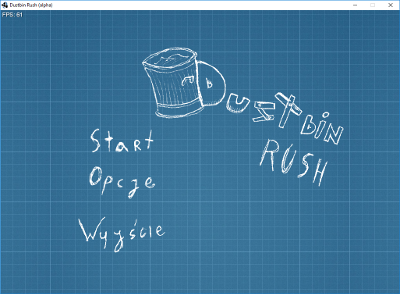
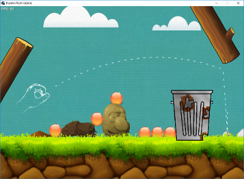

# Clockwork 2D
Clockwork2D is a game framework written in Java, powered by libGDX.

# Dustbin Rush

Game powered by the Clockwork2D.

Authors:
* Konrad Nowakowski - lead programmer and project manager
* Agnieszka Makowska - gameplay programmer and documentation introduction helper
* Wiktor Skrobiński - gameplay programmer and designer

## Commands

Press ` (tilde) key to open an in-game console. Checkout the commands table
used in the alpha version below:

| Command         | Description |
| --------------- | ----------- |
| exit            | Quits from the game |
| restart         | Restarts current running stage |
| editor filename | Opens given stage editor |
| stage filename  | Start given stage |
